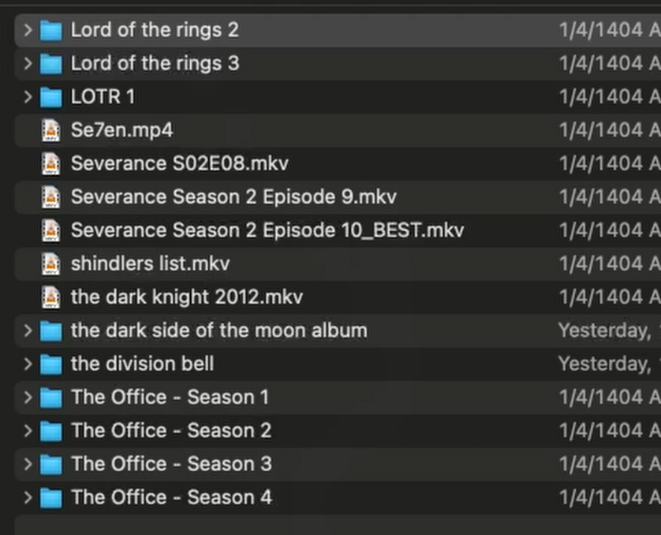
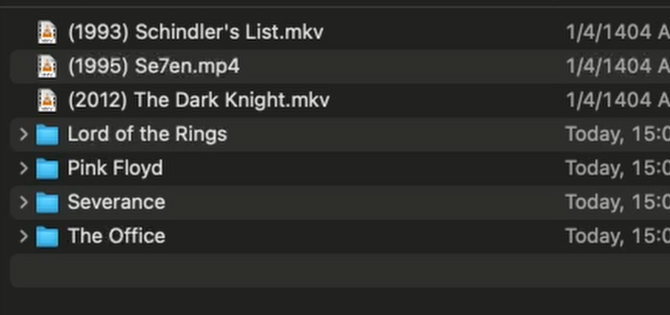

# AIOrganizer

**AIOrganizer** is a smart file and folder organizer powered by LLMs. It analyzes a list of files and folders, and suggests renaming and restructuring based on patterns, naming conventions, and best practices — perfect for tidying up media collections, personal directories, and more.

---

## 📁 What It Does

Given a list of disorganized files and folders, AIOrganizer:
- **Suggests new folder structures** by grouping related content
- **Renames files and folders** for consistency and clarity
- Follows media-friendly rules (e.g. adds movie release years, removes underscores)
- Ensures **non-destructive suggestions** — it only proposes moves/renames, letting you approve before applying changes

---

## 🎯 Tutorial Video

### 🔹 Before

### 🔸 After

